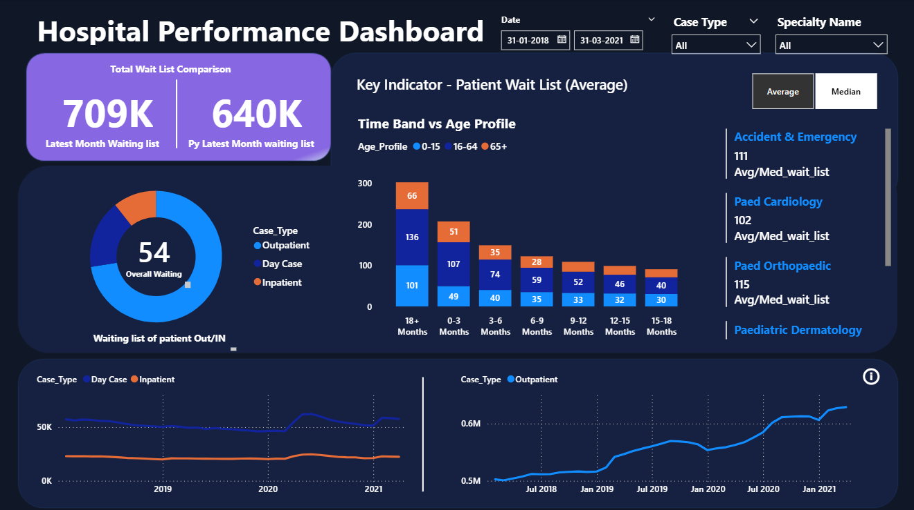
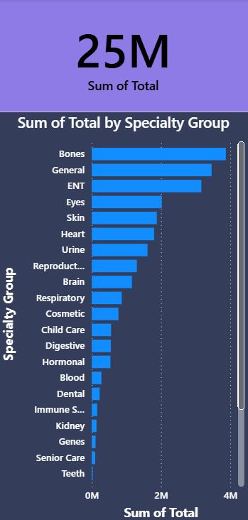

# 🏥 Hospital In and Out Patient Dashboard  

This repository contains an **interactive Power BI dashboard** for analyzing **hospital in-patient and out-patient waiting lists**.  
The dashboard helps healthcare administrators and analysts monitor waiting times, compare year-on-year data, and drill down into **specialties, case types, and patient demographics**.  

---

## 📊 Dashboard Overview  

- **Total Wait List Comparison** – Compare latest month vs. previous year waiting list.  
- **Patient Case Type Analysis** – Outpatient, Day Case, and Inpatient trends.  
- **Age Profile & Time Bands** – Distribution of patients across age groups and waiting durations.  
- **Specialty-wise Breakdown** – View average/median wait times for specialties such as Cardiology, Orthopaedics, Dermatology, etc.  
- **Interactive Filters** – Date range, case type, and specialty filters for deeper insights.  
- **Custom Toolkit Slide** – An additional page providing extended tools and insights.  

---

## 📸 Dashboard Screenshot  

  
  

---

## ⚙️ DAX Measures  

The dashboard uses **DAX (Data Analysis Expressions)** for calculations.  
Some of the important DAX formulas include:  

```DAX
-- Average Waiting List
Average_waiting_list = AVERAGE(All_Data[Total])

-- Median Waiting List
Median_waiting_list = MEDIAN(All_Data[Total])

-- Switch between Average/Median
Avg/Med_wait_list = SWITCH(
    VALUES(Calc_method[Calc_method]),
    "Average", [Average_waiting_list],
    "Median", [Median_waiting_list],
    [Median_waiting_list]
)

-- Dynamic Title for Indicator
avg/median_indicator = SWITCH(
    VALUES(Calc_method[Calc_method]),
    "Average", "Key Indicator - Patient Wait List (Average)",
    "Median", "Key Indicator - Patient Wait List (Median)"
)

-- Latest Month Waiting List
Latest_month_wait_list =
    CALCULATE(
        SUM(All_Data[Total]),
        All_Data[Archive_Date] = MAX(All_Data[Archive_Date])
    ) + 0

-- Previous Year’s Latest Month Waiting List
PY_latest_month_waiting_list =
    CALCULATE(
        SUM(All_Data[Total]),
        All_Data[Archive_Date] = EDATE(MAX(All_Data[Archive_Date]), -12)
    ) + 0

-- Handling Missing Data
NoDataLeft =
    IF(
        ISBLANK(CALCULATE(SUM(All_Data[Total]), All_Data[Case_Type] <> "Outpatient")),
        "No data For selected filter",
        ""
    )

NoDataRight =
    IF(
        ISBLANK(CALCULATE(SUM(All_Data[Total]), All_Data[Case_Type] = "Outpatient")),
        "No data For selected filter",
        ""
    )
```

## 🧹 Data Cleaning (Power Query)

The raw data was stored in **multiple CSV files** for Inpatient and Outpatient waiting lists.  
To prepare the dataset for analysis, **Power BI Power Query** was used:

- Removed duplicates & null values  
- Standardized column names and data types  
- Appended (merged) Inpatient and Outpatient tables into a single **All_Data** table  
- Ensured consistency in columns such as:  
  - `Archive_Date`  
  - `Case_Type`  
  - `Specialty_Name`  
  - `Age_Profile`  
  - `Time_Bands`  
  - `Total`  

---

## 🎯 Key KPIs

The dashboard highlights the following **Key Performance Indicators (KPIs):**

- **Latest Month Waiting List**  
- **Previous Year’s Latest Month Waiting List**  
- **Average vs. Median Waiting Time**  
- **Specialty-specific Wait Lists**  
- **Overall Patient Waiting Distribution by Case Type**  

These KPIs help in **tracking patient backlogs**, **identifying pressure points** in the healthcare system, and making **data-driven decisions**.  

---

## 🎛️ Interactivity & Filters

The dashboard includes multiple **interactive features** for deeper analysis:

- **Date Range Selector** – Choose custom analysis periods  
- **Case Type Filter** – Outpatient, Day Case, Inpatient  
- **Specialty Filter** – Focus on a particular department (Cardiology, Orthopaedics, etc.)  
- **Average/Median Toggle** – Switch between calculation methods dynamically  

---

## 📌 Additional Notes

- A **Custom Toolkit Slide** has been added for extended insights and user-defined exploration.  
- The dashboard is styled in a **light medical theme** (white + light blue/green) for clarity and accessibility.  

---

## 🚀 How to Use

1. Clone or download this repository.  
2. Open the `.pbix` file in **Power BI Desktop**.  
3. Load the CSV files into the data model if not already embedded.  
4. Use slicers and filters to explore the data interactively.  
